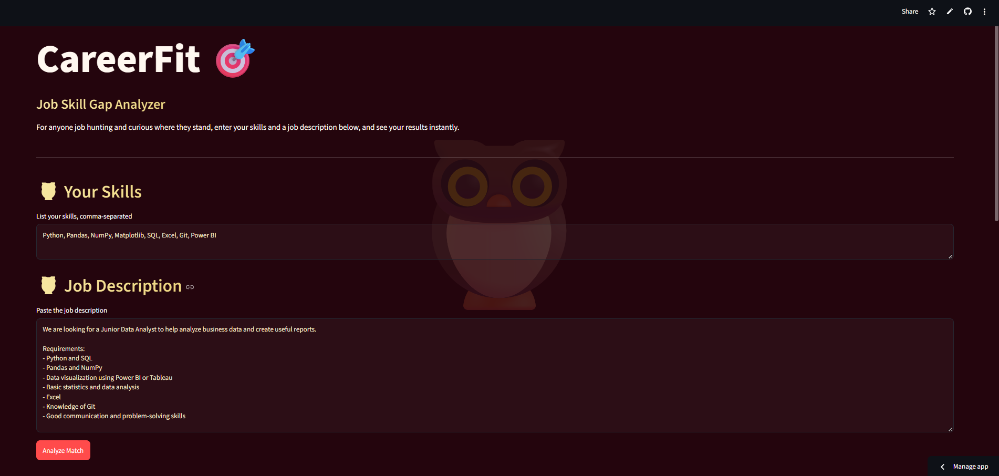
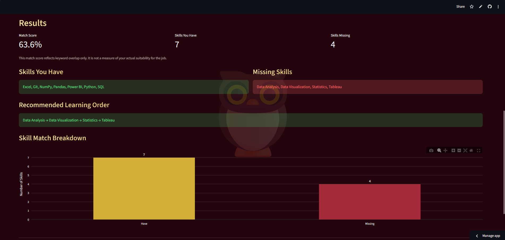

# CareerFit - Job Skill Gap Analyzer

A Streamlit app that compares your skills against a job description and shows
what you already have, what's missing, and what to learn next.

**Live demo:** https://careerfit-skill-gap.streamlit.app

## Overview

CareerFit takes two free-text inputs, your skills and a job description and
extracts recognized technical skills from both using rule-based keyword and
alias matching (no paid APIs, no heavy NLP frameworks). It then compares the
two skill sets and reports a transparent, explainable skill-match score.
There is no hardcoded skillset, anyone can use it for any job description.

## Screenshots

### Input


### Results


## Features

- Rule-based skill extraction with alias/synonym support (e.g. "ML" maps to "Machine Learning", "PowerBI" maps to "Power BI")
- Skills you have vs. skills you're missing, for a given job
- Skill match percentage (keyword overlap based)
- Prioritized "what to learn next" list, ranked by frequency in the job description
- Interactive bar chart visualization
- Custom dark theme with gradient headings, built entirely with Streamlit and lightweight custom CSS
- Fully general-purpose — no hardcoded personal skillset

## Methodology

1. **Extraction** - Both the user's typed skills and the job description are
   scanned against a dictionary of canonical skills, each with multiple
   lowercase aliases, using word-boundary regex matching.
2. **Comparison** - Extracted required skills (from the job description) are
   compared against the user's extracted skills via set intersection and
   difference.
3. **Scoring** — `match % = (matched required skills / total detected required skills) × 100`
4. **Prioritization** - Missing skills are ranked by how often they appear in
   the job description; more mentions suggests higher importance to the role.

> This match score measures keyword overlap only. It does not account for
> experience level, project depth, soft skills, or actual job fit. Use it as
> a quick signal, not a hiring decision.

## Example

**Your skills input:**
`Python, SQL, Pandas, Power BI, Excel`

**Job description input:**
`Looking for a Data Analyst skilled in Python, SQL, Pandas, Power BI, Excel, Statistics and Tableau.`

**Output:**
- Match: 71.4%
- Have: Python, SQL, Pandas, Power BI, Excel
- Missing: Statistics, Tableau
- Priority: Statistics → Tableau

## Technologies

- Python 3.12
- Streamlit
- Pandas
- Plotly
- Regex (standard library)

## Installation

```bash
git clone https://github.com/dakshita01/careerfit.git
cd careerfit
python3 -m venv venv
source venv/bin/activate   # Windows: venv\Scripts\activate
pip install -r requirements.txt
```

## Usage

```bash
streamlit run app.py
```

Enter your skills and paste a job description, then click **Analyze Match**
to see your results below. Both inputs are parsed using the same rule-based
skill recognizer, so phrasing like "scikit learn" or "powerbi" is
automatically normalized.

## Project Structure

```
careerfit/
├── README.md
├── app.py
├── requirements.txt
├── .gitignore
├── LICENSE
├── src/
│ ├── init.py
│ ├── config.py
│ ├── skill_extractor.py
│ └── analyzer.py
└── images/
├── demo_input.png
└── demo_results.png
```

## Limitations

- Rule-based matching only recognizes skills present in the predefined
  dictionary; it cannot detect skills outside that vocabulary.
- Cannot infer skill proficiency or years of experience, only presence or absence.
- Single-letter skills (like "C" or "R") require specific phrasing to avoid
  false positives (e.g. "R programming" rather than a bare "R").
- The match score is a keyword-overlap heuristic, not a real job-fit assessment.

## Future Improvements

- Expand the skill dictionary and allow user-submitted additions
- Support uploading a resume (PDF) to auto-extract the user's skills
- Add fuzzy matching for typos or variants not in the alias list
- Skill categorization (e.g. Programming, BI Tools, Soft Skills)
- Export analysis results as PDF or CSV

## License

MIT — see [LICENSE](LICENSE) for details.

---

Built with curiosity by **Dakshita Biwal** — turning small ideas into real, usable tools.